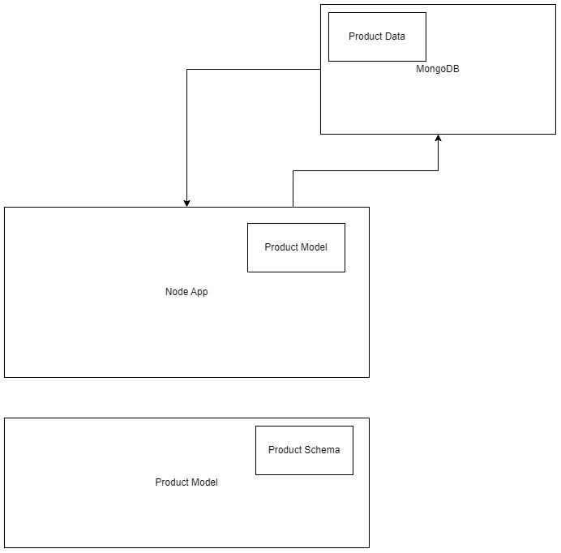

# **Stage 2 - A simple CRUD Api written in NODE.JS.**

## **Description**

This API is written using Node.js, with Express as the web framework, and MongoDB as the database. The API allows users to create, retrieve, update, and delete a products data from the database. The project's entry point is `server.js`.

## **API Documentation**

The API is fully documented, and can be found [here](https://documenter.getpostman.com/view/29761325/2s9YC5zYqn).

## UML Diagram



## Testing

Unit tests/feature tests were not part of the requirements, but from the API docs in the link above, you will be able to test it on Postman.
The API is deployed to [amadidaniell.onrender.com](https://amadidaniell.onrender.com/api)

## **Known Limitations and Assumptions**

This API assumes that product records are uniquely identified by their _id provided by MongoDB. The API uses MongoDB for storage. Error responses are standardized but can be further customized to meet specific requirements.

## **Local Setup:**

* Install the latest version of Node.js.
* Clone this repository.
  ```git clone https://github.com/nielsen2e/HNGx.git```
* Change Branch
  ```git checkout stage2```
* Install the required packages:
  ```npm install express mongoose body-parser```
* Ensure you have MongoDB installed and running.
* Run the application:
  ``` node index.js ```
* The API will be accessible locally at <http://127.0.0.1:5000/api>

